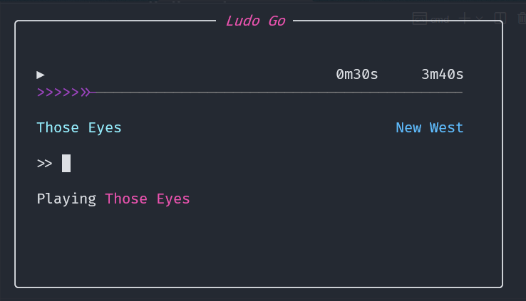

# LUDO-GO

A CLI music player which can stream music as per commands. The searching and streaming is done from Piped Api. The VLC player is used for playback.

## Features

- [x] Search and play audio
- [x] Build a song queue
- [x] Remove or skip songs in queue
- [x] Start radio of related songs for the given query
- [x] View recently played and most played song
- [x] Caching songs
- [x] play, pause, forward, rewind song
- [x] Config files to save some defaults
- [ ] save and load playlists
- [ ] play songs from recent, most played and liked songs list

## Usage

- Launch app from binary directly.
- Place binary in PATH and launch from anywhere using commandline

### Commands

The following commands are available

play, add             - play the song | play <song name>  
search, s             - search the song and display search result | search <song name>  
radio                 - start radio for song | radio <song name>  
pause, resume, p      - toggle pause/resume  
showq, q              - display song queue  
curr, c               - display current song  
skipn, n              - skip to next song  
skipb, b              - skip to previous song  
skip                  - skip to the specified index, default is 1 | skip <index>  
remove, rem           - remove song at specified index, default is last | remove <index>  
removeAll, reml       - remove all songs stating from at specified index, default is current+1 | removeAll <index>  
forward, f            - forwads playback by 10s ** | forward <seconds>  
rewind, r             - rewinds playback by 10s ** | rewind <seconds>  
setVol, v             - sets the volume by amount (0-100) | setVol <volume>  
stop                  - resets the player  
listSongs, ls         - displays list of songs based on criteria (recent,likes,plays) | listSongs <criteria>  
checkApi              - check the current piped api  
setApi                - set new piped api | setApi <piped api>  
listApi               - display all available instances  
randApi               - randomly select an piped instance  
version               - display application details  
quit                  - quit application  

### Config properties

The following properties can be configured

config.piped.apiUrl   - default piped api to be used  
config.piped.instanceListApi - default instance list api to be used  
config.cache.enabled  - enable/disable audio caching, enabled by default  
config.cache.path     - path to audio caching  
config.database.path  - path to db  
config.source.isPiped - enable piped as default source for audio searching  

## Installation

1. Make sure VLC Player *>=3.0.18* is available on the PATH
2. Download binary, place in a location and add the location to PATH
3. Open terminal and type in `ludo`. Enter help for list of commands.

### PreRequisite

1. VLC Player
The player is build on libvlc bindings to [libvlc v3.0.18](https://www.nuget.org/packages/VideoLAN.LibVLC.Windows/3.0.18).  
VLC Player *>=3.0.1* should be installed and be added to the path.

## Build

1. Follow instructions on [libvlc-go](https://github.com/adrg/libvlc-go) to setup libvlc
2. Add the following Go Env variables

	`CGO_CFLAGS="-I$PATH_TO_LIBVLC/include"`  
	`CGO_LDFLAGS="-L$PATH_TO_LIBVLC"`  
	`CGO_ENABLED=1`
3. Build the binaries

	`go build -o bin/ludo.exe main.go`
